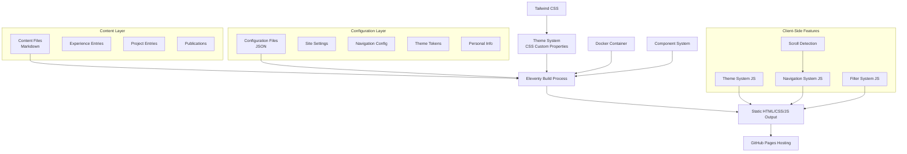

# Design Document

## Overview

The personal portfolio website is designed as a single-page application built with Eleventy (11ty) static site generator, featuring a **sidebar navigation layout** with a unified filtering system that allows visitors to explore work across Science, Policy, and Technology domains. The architecture emphasizes performance, maintainability, and accessibility while providing a modern, professional user experience.

The design leverages a container-first development approach with Docker, implements a centralized theme system for consistent styling, and maintains strict separation between content (markdown) and configuration (JSON) to ensure scalability and ease of maintenance.

### Layout Architecture

The site uses a **two-column layout**:
- **Left Sidebar**: Fixed navigation with personal information (name + description), content filtering controls (All, Science, Policy, Tech), and section navigation (About, Experience, Projects, Publications)
- **Right Content Area**: Scrollable main content organized by sections, with content filtered by tags (Science, Policy, Technology)

**Sidebar Layout Order** (top to bottom):
1. Personal name ("Your Name")
2. Brief personal description text
3. **Content filter buttons** (All, Science, Policy, Tech) - **MOVED HERE for visibility**
4. Section navigation links (About, Experience, Projects, Publications)

The filtering system operates at the **section level** - when a tag filter is applied, entire sections are shown/hidden based on whether they contain content with matching tags. The "All" filter shows all sections with their complete content.

**CRITICAL LAYOUT CHANGE**: Filter buttons have been moved from the main content area to the sidebar (positioned between personal description and section navigation) to ensure they are always visible and properly styled with high contrast colors.

## Architecture

### Technology Stack

- **Static Site Generator**: Eleventy (11ty) for fast, SEO-friendly static generation
- **Styling**: Tailwind CSS with custom design tokens and theme system
- **JavaScript**: Vanilla ES6 for lightweight client-side filtering functionality
- **Development Environment**: Docker containers for consistent development experience
- **Hosting**: GitHub Pages for simple, reliable static hosting
- **Build Process**: npm scripts orchestrating Eleventy and Tailwind CSS compilation

### System Architecture



### File Structure

```
src/
├── _data/                          # Configuration (JSON)
│   ├── site.json                   # Site metadata and settings
│   ├── app-theme.json              # Design system tokens
│   ├── component-variants.json     # UI component definitions
│   └── navigation.json             # Navigation structure
├── _includes/                      # Templates and components
│   ├── layouts/
│   │   ├── base.njk               # Base HTML structure
│   │   └── page.njk               # Page layout
│   └── components/
│       ├── ui/                    # Reusable UI components
│       ├── filter-system.njk      # Content filtering interface
│       ├── experience-card.njk    # Experience entry display
│       └── work-item-card.njk     # Unified project/publication display
├── assets/
│   ├── css/
│   │   ├── design-tokens/         # Theme system CSS
│   │   └── main.css              # Main stylesheet
│   ├── js/
│   │   └── filter.js             # Client-side filtering logic
│   └── images/                   # Static images and media
├── content/                      # Content collections (Markdown)
│   ├── experience/               # Professional experience entries
│   └── work/                     # Unified projects and publications
├── pages/                        # Main site pages (Markdown)
│   ├── index.md                  # Homepage
│   ├── contact.md                # Contact information
│   └── resume.md                 # Resume/CV page
└── static/                       # Static files (PDFs, etc.)
    └── resume.pdf                # Downloadable CV
```

## Components and Interfaces

### Core Components

#### 1. Enhanced Navigation System
**Purpose**: Provides sidebar navigation with scroll-based highlighting and smooth scrolling functionality
**Location**: `src/_includes/components/site-navigation.njk`

**Interface**:
```javascript
// Navigation state management
const NavigationSystem = {
  activeSection: null,
  sections: [], // Array of section elements
  navItems: [], // Array of navigation links
  
  // Scroll detection and highlighting
  detectActiveSection(),
  highlightNavItem(sectionId),
  
  // Smooth scrolling
  scrollToSection(sectionId),
  
  // Event binding
  bindScrollEvents(),
  bindClickEvents(),
  
  // Initialization
  init()
}
```

**Functionality**:
- Detects current section based on scroll position
- Highlights corresponding navigation item in sidebar
- Provides smooth scroll to sections when navigation items are clicked
- Maintains proper offset for fixed headers
- Updates URL hash without triggering page jump

#### 2. Filter System Component
**Purpose**: Provides the unified filtering interface for Science/Policy/Tech content in the sidebar
**Location**: `src/_includes/components/filter-system.njk` (integrated into sidebar)

**Interface**:
```javascript
// Filter state management
const FilterSystem = {
  activeFilter: 'all', // 'all' | 'science' | 'policy' | 'tech'
  filterContent(filter),
  updateUI(filter),
  bindEvents()
}
```

**Functionality**:
- Renders filter buttons with high contrast and clear visibility
- Positioned in sidebar directly below personal description
- Manages client-side content visibility
- Provides smooth transitions between filter states
- Maintains accessibility with proper ARIA labels
- Uses distinct colors for active/inactive states with minimum 3:1 contrast ratio

**CRITICAL FIX NEEDED**: Current filter buttons are invisible due to color contrast issues. Must implement proper theme-aware styling with:
- Clear background colors for button states
- High contrast text colors
- Distinct active/inactive visual states
- Proper hover and focus indicators

#### 3. Personal Information Component
**Purpose**: Displays personal branding, description, and content filters in sidebar
**Location**: `src/_includes/components/personal-info.njk`

**Interface**:
```yaml
# Input from site configuration
name: string
description: string  # Brief personal description
avatar?: string     # Optional profile image
```

**Functionality**:
- Displays "Your Name" with proper typography
- Shows brief description text below name
- Includes filter buttons (All, Science, Policy, Tech) directly below description
- Maintains theme consistency and proper contrast for all elements
- Ensures filter buttons are clearly visible and distinguishable
- Responsive design for different screen sizes

**CRITICAL ISSUE**: Filter buttons currently have visibility problems due to insufficient color contrast. They appear the same color as the background, making them invisible to users. The filter system must be moved to the sidebar and styled with proper contrast ratios.

#### 4. Content Card Components
**Purpose**: Standardized display components for different content types

**Experience Card** (`experience-card.njk`):
```yaml
# Input interface
title: string
organization: string
dateRange: string
description: string
tags: array[string]
location?: string
```

**Work Item Card** (`work-item-card.njk`):
```yaml
# Input interface - unified for projects and publications
title: string
description: string
type: "project" | "publication"
tags: array[string]  # science, policy, tech
collaborators?: array[string]  # Co-authors or team members
technologies?: array[string]   # For projects
journal?: string              # For publications
year?: number
links?: object
  demo?: string
  github?: string
  live?: string
  doi?: string
  external?: string
media?: object
  screenshot?: string
  tocImage?: string
  alt?: string
```

#### 3. Theme System Integration
**Purpose**: Ensures consistent theming across all components using centralized theme system approach with proper light/dark mode functionality

**CRITICAL**: This project follows a **centralized theme system** where ALL design values come from `src/_data/app-theme.json`. No hardcoded colors or styling should be used in templates or components.

**Theme Architecture**:
- **Source of Truth**: `app-theme.json` contains all colors, typography, spacing
- **CSS Layer**: Auto-generated CSS custom properties and utility classes with proper contrast ratios
- **JavaScript Layer**: Theme detection, manual toggle, and localStorage persistence
- **Component Layer**: Components use only theme variables, never hardcoded values

**Theme System Components**:

1. **Theme Detection & Toggle** (`src/assets/js/theme-system.js`):
```javascript
const ThemeSystem = {
  // Detect system preference
  getSystemPreference(),
  // Apply theme with proper contrast
  applyTheme(theme),
  // Manual toggle functionality
  toggleTheme(),
  // Persist user choice
  savePreference(theme),
  // Load saved preference
  loadPreference(),
  // Initialize on page load
  init()
}
```

2. **Enhanced Theme Variables** (generated from app-theme.json):
```css
/* Primary theme colors (adapt to light/dark automatically) */
--color-primary: /* Bright Cyan in light, Deep Teal in dark */
--color-secondary: /* Deep Teal in light, Bright Cyan in dark */
--color-surface: /* White in light, Black in dark */
--color-text: /* Black in light, White in dark */
--color-textSecondary: /* Gray variants with proper contrast */

/* Navigation-specific colors for sidebar visibility */
--color-nav-text: /* High contrast text for navigation */
--color-nav-hover: /* Hover state for navigation items */
--color-nav-active: /* Active state for current section */
--color-nav-background: /* Navigation background with proper contrast */

/* Semantic colors */
--color-success, --color-warning, --color-error, --color-info

/* Typography (from app-theme.json) */
--font-headline: 'Geologica'
--font-body: 'Source Sans 3'
--font-mono: 'JetBrains Mono'

/* Spacing (8-point grid system) */
--spacing-section: 3rem
--spacing-page: 4rem
--spacing-normal: 1rem
```

**Contrast Requirements**:
- Normal text: minimum 4.5:1 contrast ratio
- Large text (18pt+): minimum 3:1 contrast ratio
- Interactive elements: minimum 3:1 contrast ratio
- Navigation elements: enhanced contrast for visibility

**Usage Rules**:
- ✅ Use theme classes: `text-primary`, `bg-surface`, `text-nav-text`
- ✅ Use CSS variables: `var(--color-primary)`, `var(--color-nav-active)`
- ✅ Use navigation-specific classes: `text-nav-text`, `bg-nav-background`
- ❌ Never use hardcoded colors: `text-gray-900`, `bg-white`, `text-blue-600`
- ❌ Never manually specify dark mode: `dark:text-white`, `dark:bg-gray-800`

### Data Models

#### Content Entry Schema

**Experience Entry**:
```yaml
---
title: "Position Title"
organization: "Organization Name"
dateRange: "Start Date - End Date"
location: "City, State/Country"
tags: ["science", "policy", "tech"]  # One or more
featured: boolean                    # Optional highlighting
---
Markdown content describing the role, responsibilities, and achievements.
```

**Work Item Entry** (unified for projects and publications):
```yaml
---
title: "Project/Publication Title"
description: "Brief description"
type: "project" | "publication"     # Determines display format
tags: ["science", "policy", "tech"] # One or more - REQUIRED for filtering
collaborators: ["Collaborator One", "Co-author Two"]  # Team members or co-authors
technologies: ["React", "Node.js"]  # For projects only
journal: "Journal Name"             # For publications only
year: 2024                          # Optional
status: "completed" | "ongoing" | "archived"  # Optional
links:
  demo: "https://demo.example.com"  # For projects
  github: "https://github.com/user/repo"
  live: "https://live.example.com"
  doi: "10.1000/journal.2024.123456"  # For publications
  external: "https://external-link.com"
media:
  screenshot: "/assets/images/project-screenshot.jpg"  # For projects
  tocImage: "/assets/images/paper-toc.jpg"            # For publications
  alt: "Image description"
featured: boolean                   # Optional highlighting
---
Detailed description, methodology, outcomes, or technical details.
```

#### Configuration Schema

**Site Configuration** (`src/_data/site.json`):
```json
{
  "title": "Site Title",
  "description": "Site description for SEO",
  "url": "https://username.github.io",
  "author": {
    "name": "Full Name",
    "description": "Brief personal description that appears below name in sidebar",
    "email": "email@example.com",
    "orcid": "0000-0000-0000-0000"
  },
  "social": {
    "linkedin": "https://linkedin.com/in/username",
    "twitter": "https://twitter.com/username",
    "github": "https://github.com/username"
  },
  "resume": {
    "filename": "resume.pdf",
    "lastUpdated": "2024-01-15"
  },
  "navigation": {
    "sections": [
      {"id": "about", "title": "About", "href": "#about"},
      {"id": "experience", "title": "Experience", "href": "#experience"},
      {"id": "projects", "title": "Projects", "href": "#projects"},
      {"id": "publications", "title": "Publications", "href": "#publications"}
    ]
  }
}
```

## Technical Implementation Details

### Scroll Detection Algorithm

**Intersection Observer Implementation**:
```javascript
// Detect which section is currently in view
const observerOptions = {
  root: null,
  rootMargin: '-20% 0px -70% 0px', // Trigger when section is 20% visible
  threshold: 0
};

const sectionObserver = new IntersectionObserver((entries) => {
  entries.forEach(entry => {
    if (entry.isIntersecting) {
      NavigationSystem.highlightNavItem(entry.target.id);
    }
  });
}, observerOptions);
```

**Smooth Scroll Implementation**:
```javascript
// Smooth scroll with proper offset for fixed headers
function scrollToSection(sectionId) {
  const section = document.getElementById(sectionId);
  const headerOffset = 80; // Account for fixed header
  const elementPosition = section.offsetTop;
  const offsetPosition = elementPosition - headerOffset;
  
  window.scrollTo({
    top: offsetPosition,
    behavior: 'smooth'
  });
}
```

### Theme System Implementation

**Theme Detection and Application**:
```javascript
// Enhanced theme system with proper contrast
const ThemeSystem = {
  init() {
    // Load saved preference or detect system preference
    const savedTheme = localStorage.getItem('theme');
    const systemTheme = window.matchMedia('(prefers-color-scheme: dark)').matches ? 'dark' : 'light';
    const theme = savedTheme || systemTheme;
    
    this.applyTheme(theme);
    this.bindEvents();
  },
  
  applyTheme(theme) {
    document.documentElement.setAttribute('data-theme', theme);
    // Update theme toggle button state
    this.updateToggleButton(theme);
  },
  
  toggleTheme() {
    const currentTheme = document.documentElement.getAttribute('data-theme');
    const newTheme = currentTheme === 'dark' ? 'light' : 'dark';
    this.applyTheme(newTheme);
    localStorage.setItem('theme', newTheme);
  }
};
```

**CSS Theme Variables with Proper Contrast**:
```css
/* Light theme */
[data-theme="light"] {
  --color-primary: #00C3FF;
  --color-secondary: #006280;
  --color-surface: #FFFFFF;
  --color-text: #000000;
  --color-textSecondary: #4A5568;
  --color-nav-text: #2D3748;
  --color-nav-hover: #00C3FF;
  --color-nav-active: #006280;
  --color-nav-background: rgba(255, 255, 255, 0.95);
  
  /* Filter button colors - HIGH CONTRAST */
  --color-filter-inactive: #E2E8F0;
  --color-filter-inactive-text: #2D3748;
  --color-filter-active: #006280;
  --color-filter-active-text: #FFFFFF;
  --color-filter-hover: #00C3FF;
  --color-filter-hover-text: #FFFFFF;
}

/* Dark theme */
[data-theme="dark"] {
  --color-primary: #006280;
  --color-secondary: #00C3FF;
  --color-surface: #000000;
  --color-text: #FFFFFF;
  --color-textSecondary: #A0AEC0;
  --color-nav-text: #E2E8F0;
  --color-nav-hover: #00C3FF;
  --color-nav-active: #006280;
  --color-nav-background: rgba(0, 0, 0, 0.95);
  
  /* Filter button colors - HIGH CONTRAST */
  --color-filter-inactive: #2D3748;
  --color-filter-inactive-text: #E2E8F0;
  --color-filter-active: #00C3FF;
  --color-filter-active-text: #000000;
  --color-filter-hover: #006280;
  --color-filter-hover-text: #FFFFFF;
}
```

## Error Handling

### Build-Time Error Handling

1. **Content Validation**:
   - Required frontmatter fields validation
   - Tag consistency checking (only allowed: science, policy, tech)
   - Link validation for external URLs
   - Image path validation

2. **Configuration Validation**:
   - JSON schema validation for all `_data` files
   - Theme token completeness checking
   - Navigation structure validation
   - Personal information completeness checking

3. **Build Process Error Recovery**:
   - Graceful handling of missing images with fallbacks
   - Default values for optional frontmatter fields
   - Clear error messages for content authors

### Runtime Error Handling

1. **Client-Side Navigation**:
   - Fallback to anchor links if JavaScript fails
   - Progressive enhancement approach
   - Graceful degradation for older browsers

2. **Theme System**:
   - CSS fallbacks for unsupported custom properties
   - Default light theme if system preference detection fails
   - Smooth transitions with reduced motion respect
   - Fallback colors if theme variables fail to load

3. **Scroll Detection**:
   - Fallback to manual navigation highlighting if Intersection Observer is unsupported
   - Graceful degradation to standard anchor link behavior
   - Error handling for missing section elements

4. **External Link Handling**:
   - `rel="noopener noreferrer"` for security
   - Visual indicators for external links
   - Fallback behavior for broken links

## Testing Strategy

### Automated Testing

1. **Build Validation**:
   ```bash
   # File structure validation
   test -f _site/index.html
   test -f _site/assets/css/main.css
   test -f _site/static/resume.pdf
   ```

2. **Content Validation**:
   ```bash
   # Check for required content elements
   curl -s http://localhost:8080 | grep "<title>"
   curl -s http://localhost:8080 | grep "filter-button"
   curl -s http://localhost:8080 | grep "experience-card"
   ```

3. **HTTP Response Testing**:
   ```bash
   # Verify all pages respond correctly
   curl -s -o /dev/null -w "%{http_code}\n" http://localhost:8080/
   curl -s -o /dev/null -w "%{http_code}\n" http://localhost:8080/contact/
   curl -s -o /dev/null -w "%{http_code}\n" http://localhost:8080/static/resume.pdf
   ```

### Manual Testing Checklist

1. **Filtering System**:
   - [ ] All content visible by default
   - [ ] Science filter shows only science-tagged content
   - [ ] Policy filter shows only policy-tagged content
   - [ ] Tech filter shows only tech-tagged content
   - [ ] Multi-tagged content appears in relevant filters
   - [ ] Smooth transitions between filter states
   - [ ] Active filter visually indicated

2. **Theme System**:
   - [ ] Automatic system preference detection
   - [ ] Light mode displays correctly
   - [ ] Dark mode displays correctly
   - [ ] Smooth theme transitions
   - [ ] All text maintains proper contrast
   - [ ] Interactive elements remain visible

3. **Content Display**:
   - [ ] Experience entries display correctly
   - [ ] Work items (projects/publications) show all information
   - [ ] Project-type work items display technologies and collaborators
   - [ ] Publication-type work items display journal and co-authors
   - [ ] Multi-tagged work items appear in relevant filters
   - [ ] Images (screenshots/TOC images) load and display properly
   - [ ] External links open in new tabs
   - [ ] Resume PDF downloads correctly

4. **Responsive Design**:
   - [ ] Mobile layout works properly
   - [ ] Tablet layout maintains usability
   - [ ] Desktop layout utilizes space effectively
   - [ ] Filter buttons remain accessible on all screen sizes

5. **Accessibility**:
   - [ ] Keyboard navigation works throughout
   - [ ] Screen reader compatibility
   - [ ] Proper heading hierarchy
   - [ ] Alt text for all images
   - [ ] Color contrast meets WCAG standards

### Performance Testing

1. **Load Time Validation**:
   - Initial page load under 2 seconds
   - CSS and JavaScript assets optimized
   - Images properly compressed and sized

2. **Filtering Performance**:
   - Instant response to filter changes
   - No visible lag during content transitions
   - Smooth animations without jank

3. **Build Performance**:
   - Full site build completes under 30 seconds
   - Incremental builds for content changes under 5 seconds
   - Docker container startup under 1 minute

## Design Decisions and Rationales

### Single-Page Architecture
**Decision**: Implement as a single-page application with client-side filtering
**Rationale**: 
- Provides immediate, smooth filtering without page reloads
- Reduces server requests and improves performance
- Simplifies navigation and maintains context
- Enables progressive enhancement for accessibility

### Container-First Development
**Decision**: Use Docker for all development and build processes
**Rationale**:
- Ensures consistent environment across different machines
- Isolates dependencies and prevents version conflicts
- Simplifies onboarding and deployment processes
- Matches modern development best practices

### Centralized Theme System
**Decision**: Implement comprehensive theme system with CSS custom properties
**Rationale**:
- Ensures visual consistency across all components
- Enables automatic light/dark mode switching
- Simplifies maintenance and future design updates
- Provides accessibility compliance out of the box

### Content/Configuration Separation
**Decision**: Strict separation between markdown content and JSON configuration
**Rationale**:
- Enables non-technical content updates without code changes
- Reduces risk of breaking functionality during content updates
- Improves collaboration between technical and non-technical team members
- Supports version control best practices

### Static Site Generation
**Decision**: Use Eleventy for static site generation over dynamic alternatives
**Rationale**:
- Provides excellent performance with pre-generated HTML
- Simplifies hosting requirements (GitHub Pages compatible)
- Improves SEO with server-side rendering
- Reduces security concerns with no server-side processing
- Enables offline functionality and CDN optimization